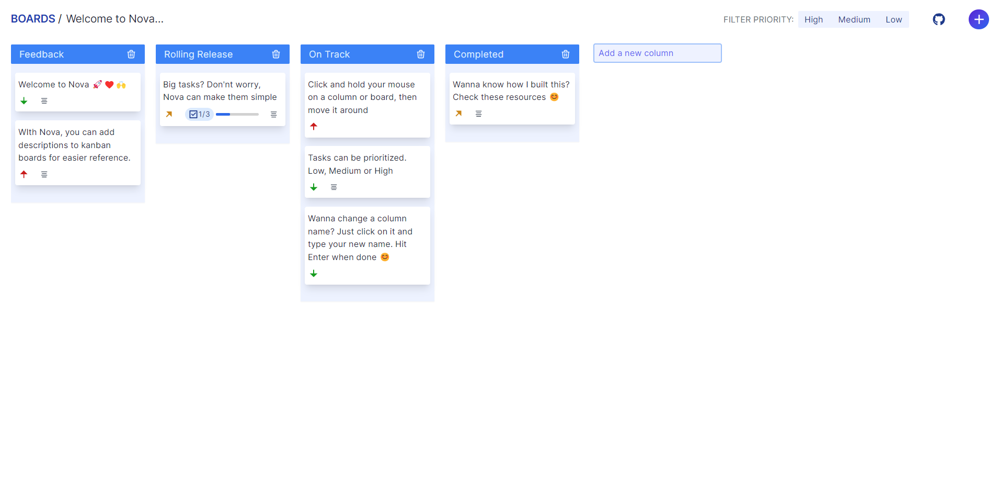

# Kamui 🚀
Create fast and efficient kanban boards, easily ✅❤️🔥

## Features

- **Plain text/markdown notes** - take notes in an efficient way
- **Markdown preview** - preview Markdown before saving
- **Drag and drop** - drag and drop a column or a board
- **Persistence** - all user data is stored in Firebase database

## About

Kamui🚀 is a kanban board for productivity. It is a web based kanban planner with superpowers. Want to get some todos listed? We got you! What about some sorting of work? We got you there too!
Our drag and drop feature allows you to move items anywhere you like, making them your own 👍
Make use of our markdown editor too, it's pretty useful. Oh and, it also has a preview for markdown files built-in. 🤯

**Kamui was created with [React](https://reactjs.org) and [Firebase](https://firebase.google.com).**

